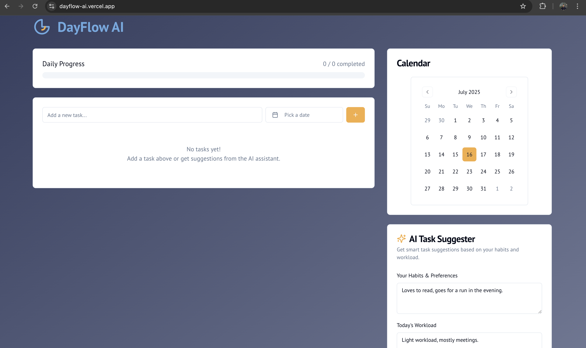

# DayFlow AI

DayFlow AI is an intelligent task management application built with Next.js and Genkit. It's designed to help you organize your daily tasks, with an AI assistant that provides smart suggestions based on your habits and workload.


## Demo



## Features

- **Task Management**: Create, edit, delete, and mark tasks as complete.
- **Prioritization**: Assign high, medium, or low priority to tasks.
- **Due Dates**: Assign due dates to tasks with an interactive calendar.
- **AI Suggestions**: Get smart task suggestions based on your habits, workload, and the time of day.
- **Progress Tracking**: Visualize your daily progress.
- **Modern Tech Stack**: Built with Next.js, React, ShadCN UI, Tailwind CSS, and Google's Genkit for AI features.

## Getting Started

Follow these instructions to get a copy of the project up and running on your local machine for development and testing purposes.

### Prerequisites

- [Node.js](https://nodejs.org/en) (v18 or later is recommended)
- [npm](https://www.npmjs.com/) (usually comes with Node.js)

### Installation & Setup

1.  **Clone the repository**
    If you have this code on your local machine, you can skip this step.
    ```sh
    git clone <repository-url>
    cd <repository-directory>
    ```

2.  **Install project dependencies**
    This command will install all the necessary packages defined in `package.json`.
    ```sh
    npm install
    ```

3.  **Set up Environment Variables**
    The AI features in this application use Google's Gemini model via Genkit. You'll need an API key to enable them.

    - Create a file named `.env` in the root of your project.
    - Get a free API key from the [Google AI Studio](https://aistudio.google.com/app/apikey).
    - Add the API key to your `.env` file like this:
      ```
      GOOGLE_API_KEY=your_api_key_here
      ```

### Running the Application

Once you've installed the dependencies and set up your environment variable, you can run the application with a single command:

```sh
npm run dev
```

This will start the Next.js development server, typically on [http://localhost:9002](http://localhost:9002). Open this URL in your browser to see the application in action.

The terminal will show you the exact address. Any changes you make to the code will be automatically reloaded in the browser.
